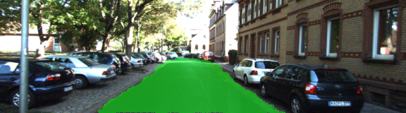
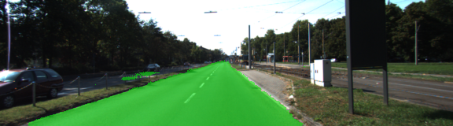
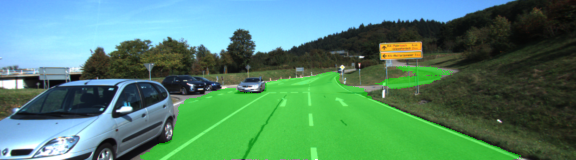
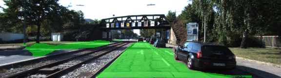
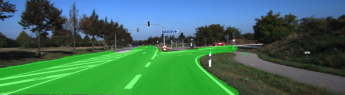

# CarND - Semantic Segmentation Rubrics
In this project, the goal is to label the pixels of a road in images using a Fully Convolutional Network (FCN). A pretrained VGG-16 network is used as a base model and trained & tested on the KITTI data set.

## Neural Network Architecture
A pre-trained VGG-16 network was converted to a fully convolutional network by converting the final fully connected layer to a 1x1 convolution and setting the depth equal to the number of desired classes (in this case, 2: road and not-road). Performance is improved through the use of skip connections, performing 1x1 convolutions on previous VGG layers (in this case, layers 3 and 4) and adding them element-wise to upsampled (through transposed convolution) lower-level layers (i.e. the 1x1-convolved layer 7 is upsampled before being added to the 1x1-convolved layer 4). Each convolution and transpose convolution layer includes a kernel initializer and regularizer.

### Optimizer
The loss function for the network is `cross-entropy`, and an `Adam optimizer` is used.

## Rubric Points

#### Does the project load the pretrained vgg model?
The function `load_vgg` loads `vgg` model.

#### Does the project learn the correct features from the images?
The project has `layers` function implemented.

#### Does the project optimize the neural network?
The project has `optimize` function implemented.

#### Does the project train the neural network?
The function `train_nn` is implemented correctly. The loss of the network should be printed while the network is training.

Sample output:
```
Model build successful, starting training
-----------------------
| Epoch # | Avg. Loss |
-----------------------
|       1 |     0.788 |
|       2 |     0.467 |
|       3 |     0.171 |
|       4 |     0.146 |
|       5 |     0.130 |
|       6 |     0.117 |
|       7 |     0.110 |
|       8 |     0.097 |
|       9 |     0.085 |
|      10 |     0.077 |
|      11 |     0.076 |
|      12 |     0.063 |
|      13 |     0.063 |
|      14 |     0.056 |
|      15 |     0.051 |
|      16 |     0.047 |
|      17 |     0.056 |
|      18 |     0.049 |
|      19 |     0.043 |
|      20 |     0.041 |
|      21 |     0.038 |
|      22 |     0.038 |
|      23 |     0.035 |
|      24 |     0.034 |
|      25 |     0.033 |
|      26 |     0.032 |
|      27 |     0.031 |
|      28 |     0.031 |
|      29 |     0.032 |
|      30 |     0.036 |
|      31 |     0.030 |
|      32 |     0.028 |
|      33 |     0.026 |
|      34 |     0.025 |
|      35 |     0.025 |
|      36 |     0.024 |
|      37 |     0.024 |
|      38 |     0.023 |
|      39 |     0.023 |
|      40 |     0.023 |
|      41 |     0.022 |
|      42 |     0.021 |
|      43 |     0.020 |
|      44 |     0.021 |
|      45 |     0.020 |
|      46 |     0.019 |
|      47 |     0.019 |
|      48 |     0.019 |
|      49 |     0.019 |
|      50 |     0.018 |
```

### Does the project train the model correctly?
As seen from above output sample, the model decreases loss over time.

### Does the project use reasonable hyperparameters?

The hyperparameters used for training are:
* keep_prob: 0.8
* learning_rate: 0.0001
* epochs: 50
* batch_size: 8

### Does the project correctly label the road?
Below are a few sample images from the output of the fully convolutional network, with the segmentation class overlaid upon the original image in green.





